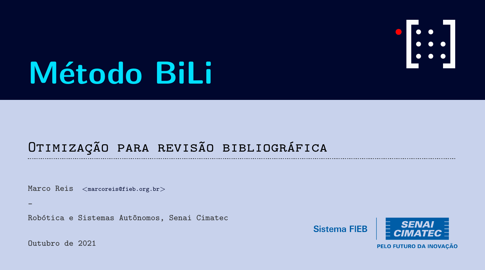

# Método BiLi - Uma otimização para revisão bibliográfica 

<p align="center">
  
</p>

## How To Use

To clone and run this beamer, follow command line above:

```bash
# Clone this repository
$ git clone https://github.com/mhar-vell/mharvellous-beamer

# Go into the repository
$ cd mharvellous-beamer

# Open on VS Code
$ code .

```

## Mini-course description
No curso será apresentado uma nova metodologia de pesquisa para o estudo das revisões bibliográficas chamado método BILI  (Bibliographic and Literary Review Method). Este método consiste na busca dos artigos e assuntos de maior impacto no mundo acadêmico na área em que se realizou a busca. Dessa forma, será possível extrair as palavras chaves da pesquisa e os artigos mais relevantes para sua pesquisa. Portanto, a velha forma de buscar artigos um a um e fazer a leitura do mesmo, sendo de uma busca que retornou vários artigos, é um trabalho muito lento e cansativo, sem mencionar que a busca não está otimizada e pode deixar passar vários artigos com maior relevância para sua pesquisa. Será utilizado as seguintes ferramentas: R, Bibliometrix, Litsearch, RevTools, CmapTools e Mendeley.

## Pré-requisitos
- Instalar R com versão igual ou superior à 3.5:

    - Instalar R: 
      - [Windows](https://cran.r-project.org/bin/windows/base/)

      - [Ubuntu-18.04](https://rtask.thinkr.fr/installation-of-r-3-5-on-ubuntu-18-04-lts-and-tips-for-spatial-packages/)

      - [Ubuntu-20.04](https://www.digitalocean.com/community/tutorials/how-to-install-r-on-ubuntu-20-04-pt)

    
    - Instalar RStudio:
      - [Ubuntu-18.04](https://www.rstudio.com/products/rstudio/download/)

      - [Ubuntu-20.04](https://linuxconfig.org/how-to-install-rstudio-on-ubuntu-20-04-focal-fossa-linux)

Dentro do Console do R instalar os seguintes pacotes:
- Bibliometrix
  ```
  install.packages("bibliometrix")
  ```

- LitSearchR
  ```
  install.packages("remotes")

  remotes::install_github("elizagrames/litsearchr", ref="main")
  install.packages("devtools")
  ```

- RevTools
  - No terminal rode este comando antes: `sudo apt-get install gsl-bin libgsl0-dev`
  ```
  install.packages("revtools")
  ```

Instalar o CmapTools e o Mendeley:

- CmapTools
  - Instalar no [Windows](https://cmaptools.br.uptodown.com/windows)

  - Instalar no [Ubuntu-18.04](https://cmap.ihmc.us/cmaptools/cmaptools-download/)
    ```
    $ cd ~/Downloads
    $ chmod +x CmapTools.bin
    $ ./CmapTools.bin
    ```
- Mendeley
  - Instalar no [Windows](https://www.mendeley.com/download-desktop-new/)
  - Instalar no [Ubuntu-20.04](https://www.mendeley.com/guides/download-mendeley-desktop/ubuntu/instructions)

> Além destas orientações acima o curso foi elaborado também no [Google Colab](https://drive.google.com/file/d/1Cb06gWAdtyAJgm9FN6dLEneo1l3pZq6f/view?usp=sharing)

# Documentação

- [Bibliometrix](https://cran.r-project.org/web/packages/bibliometrix/bibliometrix.pdf)
- [LitSearchR](https://elizagrames.github.io/litsearchr/#tutorials)
- [RevTools](https://cran.r-project.org/web/packages/revtools/revtools.pdf)

# Palestrante
- Anderson Queiroz tem graduação em Engenharia da Computação pela Universidade Estadual de Feira de Santana (UEFS). Em sua graduação trabalhou nos projetos de um Estimador de Posição e Atitude para um VANT, utilizando microcontroladores PIC, foi monitor das disciplinas de Circuitos Elétricos e Eletrônicos, Circuitos Digitais e Introdução a Eletrônica. Participou do programa de intercâmbio, custeado pela própria universidade, em Portugal, Lisboa. Sua linha de pesquisa de conclusão de curso foi dirigida na área de processamento digital de sinais, com a aplicação direcionada a biometria de voz utilizando uma rede neural. Foi estagiário na empresa MSC Engenharias por 6 meses para automação do processo de prensas hidráulicas. Após a graduação trabalhou na empresa Gerenciagram por 1 ano e 6 meses na área de aplicações web utilizando Python, PHP, banco de dados SQL e servidores Amazon. Tem especialização na área de Robótica e Sistemas Autônomos do Laboratório de Robótica do Senai Cimatec.
- [Marco Reis](https://mhar-vell.github.io/portfolio/) tem 20 anos de experiência em gestão industrial, incluindo a implementação de duas fábricas de automóveis no Brasil (Renault e Ford), bem como na indústria siderúrgica, geração de energia, automação e robótica, especialmente na ABB. Marco desenvolveu projetos nas áreas de ferramentas robóticas e manipuladores, equipamentos autônomos, gerenciamento de ativos, RCM, TPM, confiabilidade e manutenção em equipamentos críticos. Atualmente é pesquisador sênior do Senai Cimatec coordenando projetos de robótica e liderando o grupo de robótica no Senai Cimatec em parceria com o Instituto Alemão de Inteligência Artificial (DFKI). Seu foco de interesse em pesquisa é em autonomia e confiabilidade aplicadas em robôs.

# Agradecimentos
Ao [Senai-Cimatec](http://www.senaicimatec.com.br/) por proporcionar esta oportunidade ímpar de aprendizado. Agradecemos a todos os envolvidas neste projeto, assim como a equipe do Centro de Competências em Robótica e Sistema Autônomos.

## Mantenedores
- Anderson Vale (anderson_qdv@hotmail.com)
- Marco Reis (marcoreis@fieb.org.br)

## Important
Presentation better to view on **[Okular]**

[Okular]: https://okular.kde.org